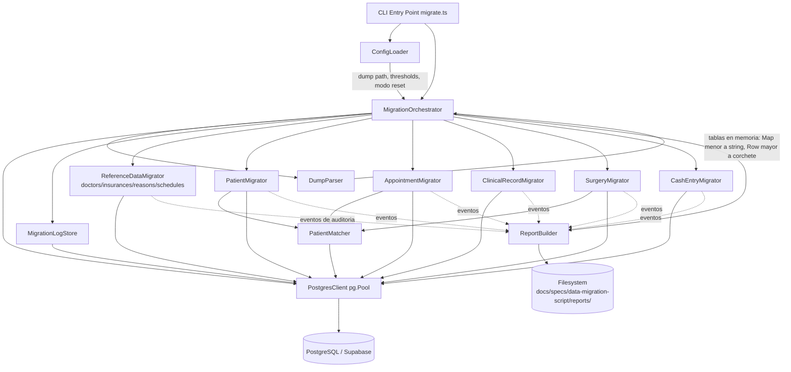
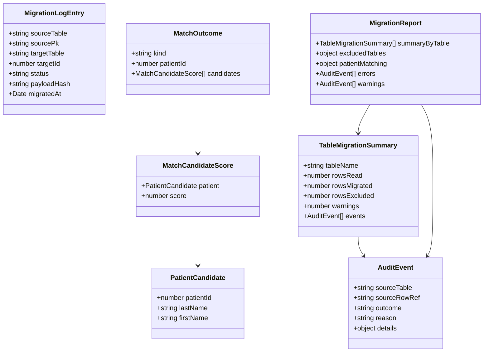
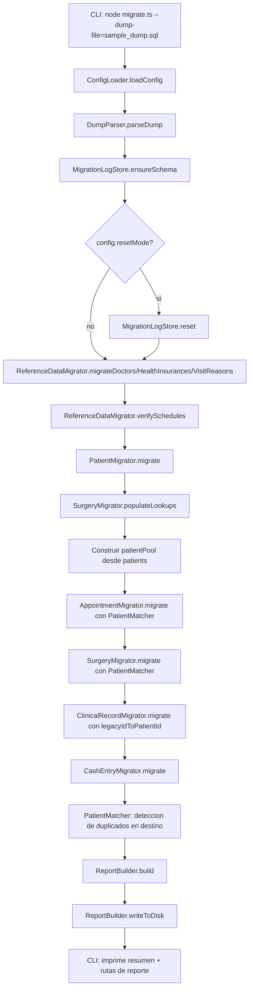
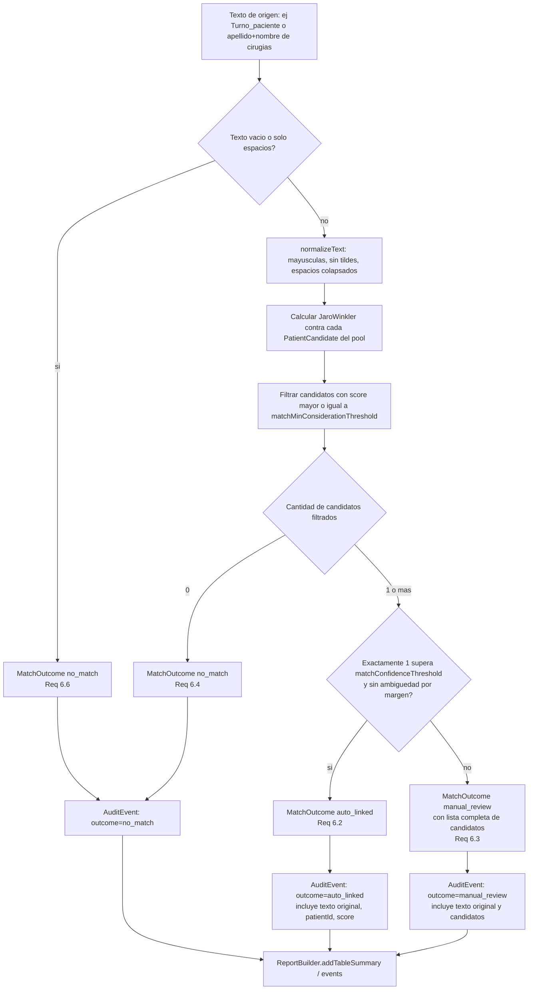
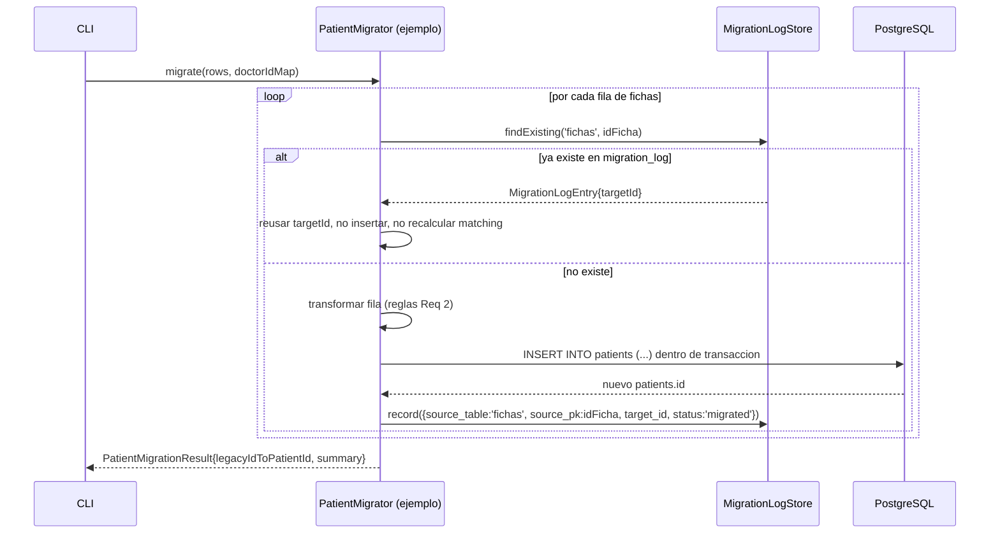

# Design Document

## Overview

Este documento describe el diseño técnico del script de migración de datos que traslada la base legacy MySQL "instituto" (dump en texto plano, formato `mysqldump`) hacia el esquema PostgreSQL/Supabase ya definido en `schema.sql`. El diseño toma como entrada fija los requisitos aprobados en `requirements.md` y las decisiones de mapeo de `docs/sdd.md` (secciones 4 y 5), y se concentra en traducirlos a componentes de software concretos, estructuras de datos y procesos ejecutables.

El script es una herramienta de línea de comandos en Node.js/TypeScript, standalone, que no depende de la aplicación Next.js ni la modifica. Se ejecuta de forma manual por el responsable de la migración, contra un archivo de dump configurable (`sample_dump.sql` hoy, el dump completo de producción en el futuro), y produce:

1. Los datos migrados e insertados en PostgreSQL (Supabase).
2. Un reporte auditable en disco (JSON + Markdown) con el detalle de qué se migró, qué se marcó con advertencia, qué se excluyó y qué quedó pendiente de revisión manual.
3. Una tabla de control en el propio Postgres destino (`migration_log`) que permite reejecutar el script de forma idempotente.

Decisiones clave de este diseño (justificadas en detalle en cada sección):

- **Parsing del dump como texto SQL, no carga en una instancia MySQL temporal.** El dump es relativamente pequeño (decenas de miles de filas en el peor caso de producción, no millones), usa una sintaxis `mysqldump` simple (`INSERT INTO ... VALUES (...);`), y no se dispone de FKs ni de lógica de negocio en el motor que valga la pena ejecutar en MySQL real. Levantar una instancia temporal (Docker MySQL o SQLite) agrega una dependencia operativa pesada (Docker, o un motor SQL embebido con sus propias reglas de tipos) para un beneficio marginal, dado que toda la transformación de datos (fechas sentinela, montos con coma, fuzzy matching) ocurre igual en JavaScript después de extraer los valores. Se opta por un parser de texto dedicado, tolerante a las particularidades reales del dump (charset utf8 con tildes/ñ, escapes de comillas, `\r\n` embebidos, multi-row `VALUES` si aparecieran en el dump completo).
- **Cliente PostgreSQL: `pg` (`node-postgres`).** Necesitamos control fino de transacciones explícitas (`BEGIN`/`COMMIT`/`ROLLBACK`), inserciones por lotes parametrizadas, y la posibilidad de ejecutar todo dentro de una transacción por tabla (o por todo el run) para poder hacer rollback ante error. `postgres.js` es una alternativa válida pero menos madura en el ecosistema/tooling de Supabase; el cliente `supabase-js` está pensado para uso desde la aplicación (vía PostgREST, con RLS) y no es el canal adecuado para una carga masiva administrativa con transacciones — además perderíamos control transaccional real. `pg` es la opción estándar, mejor documentada y suficiente en performance para el volumen esperado (no se justifica `COPY`, ver sección de Performance).
- **Fuzzy matching: distancia Jaro-Winkler vía la librería `natural`.** Jaro-Winkler está diseñado específicamente para nombres propios cortos y da más peso a coincidencias en el prefijo de la cadena, lo cual es ideal para apellidos españoles (donde el inicio de la palabra rara vez varía, pero el final puede tener variaciones de tipeo). Es superior a Levenshtein puro para este caso de uso (ver justificación detallada en Componentes). `natural` ya incluye `JaroWinklerDistance` junto con utilidades de normalización de texto, evitando sumar múltiples dependencias pequeñas.
- **Idempotencia vía tabla de control `migration_log`** en el propio Postgres destino, que registra `(source_table, source_pk, target_table, target_id, status, payload_hash)`. Resuelve simultáneamente el Requirement 9 (no duplicar en reejecuciones) y el Requirement 2.7 (mapeo `idFicha` → `patients.id` disponible para `cirugias`, `inst_turnos`, `historiaclinica`).

## Architecture

### System Architecture Diagram



### Data Flow Diagram

```mermaid
graph LR
    A[sample_dump.sql /<br/>dump produccion] --> B[DumpParser]
    B --> C{Tabla en alcance?}
    C -->|inst_alt, medias, ventamedias| D[Registrar como<br/>excluida intencional]
    C -->|si| E[Estructuras en memoria<br/>por tabla legacy]

    E --> F[Migradores por tabla<br/>orden de dependencia]
    F --> G[MigrationLogStore<br/>consulta legacy_id ya migrado?]
    G -->|ya migrado| H[Reusar target_id<br/>idempotencia]
    G -->|nuevo| I[Transformar fila<br/>aplicar reglas docs/sdd.md]

    I --> J{Requiere resolver<br/>paciente en texto libre?}
    J -->|si| K[PatientMatcher<br/>Jaro-Winkler]
    K --> L{Resultado}
    L -->|auto-vinculado| M[patient_id resuelto]
    L -->|ambiguo / sin match| N[patient_id = NULL]

    J -->|no| O[Continuar transformacion]
    M --> O
    N --> O

    O --> P[INSERT en Postgres<br/>dentro de transaccion]
    H --> P
    P --> Q[Registrar en migration_log]
    Q --> R[Emitir evento de auditoria]
    D --> R
    R --> S[ReportBuilder]
    S --> T[reporte.json + reporte.md<br/>con timestamp]
```



## Components and Interfaces

### ConfigLoader

Responsable de centralizar todos los parámetros configurables del script, cumpliendo Requirement 9.3, 10.2 y 6.9.

```typescript
type MigrationConfig = {
  /** Ruta al archivo de dump a procesar. Configurable, nunca hardcodeada (Req 10.2). */
  dumpFilePath: string;

  /** Cadena de conexión a Postgres (Supabase). Se lee de variable de entorno. */
  databaseUrl: string;

  /** Umbral de confianza: por encima de este score, un único candidato se auto-vincula (Req 6.2). */
  matchConfidenceThreshold: number; // default 0.92

  /** Umbral mínimo de consideración: por debajo, el candidato ni siquiera se cuenta como "candidato" (Req 6.3/6.4). */
  matchMinConsiderationThreshold: number; // default 0.75

  /** Si true, trunca/reinicia el estado de migración antes de correr (Req 9.3). */
  resetMode: 'log-only' | 'full';

  /** Directorio de salida para los reportes (Req 8.5). */
  reportOutputDir: string; // default: ./reports

  /** Tope de filas por statement INSERT al cargar al destino (tuning de performance, no de negocio). */
  insertBatchSize: number; // default 500
};

function loadConfig(argv: string[], env: NodeJS.ProcessEnv): MigrationConfig;
```

Los valores llegan por flags de CLI (`--dump-file`, `--reset`, `--match-threshold`, `--match-min-threshold`) con fallback a variables de entorno (`.env`) y luego a defaults. Esto satisface Requirement 6.9 (umbrales configurables sin tocar lógica) y Requirement 10.5 (recalibración ante el dump completo).

### DumpParser

Responsable de leer el archivo de dump y producir una representación en memoria de cada tabla en alcance, sin ejecutar nada contra un motor SQL real.

**Por qué parsing de texto y no una instancia MySQL/SQLite temporal:** el dump es `mysqldump` puro (`CREATE TABLE` + `INSERT INTO ... VALUES (...);`), sin triggers, vistas, ni procedimientos. Todo el valor que aportaría un motor real (parseo de tipos, ejecución de constraints) no aplica aquí porque MyISAM no tenía FKs y los `CREATE TABLE` solo informan tipos column por columna, que ya conocemos de antemano por tabla. Cargar una instancia MySQL temporal (vía Docker) introduce una dependencia de infraestructura pesada y un punto de fallo adicional (versión de Docker disponible, compatibilidad del charset, tiempo de arranque) solo para volver a leer los mismos valores con `SELECT *`. Un parser de texto dedicado, bien probado contra la gramática real observada en el dump, es más simple de versionar, testear unitariamente (fixtures de texto) y depurar.

**Diseño del parser:** no es un parser SQL genérico (se descarta `node-sql-parser` como dependencia completa) sino un parser de propósito específico para la gramática de `mysqldump`, porque:
- Conocemos de antemano el subconjunto exacto a soportar: `CREATE TABLE` (solo para extraer nombres de columnas en orden), `INSERT INTO `tabla` VALUES (...), (...), ...;` con posible multi-row, y directivas `/*!...*/`, `LOCK TABLES`, `UNLOCK TABLES` que se ignoran.
- Debe tolerar: comillas simples escapadas (`\'`), backslashes (`\\`, `\r\n` literal dentro de un valor de texto), valores `NULL` sin comillas, números sin comillas, y el charset utf8 con tildes/ñ (Node maneja UTF-8 nativamente al leer el archivo con encoding `utf8`, así que no se requiere transcodificación adicional — se verifica únicamente que el archivo se lea con el encoding correcto).
- Debe soportar tanto el caso observado en `sample_dump.sql` (una fila por sentencia `INSERT INTO ... VALUES (fila);`) como el caso de múltiples tuplas por sentencia (`INSERT INTO ... VALUES (fila1),(fila2),(fila3);`) que es la forma habitual en la que `mysqldump` exporta tablas grandes — el dump de producción casi seguro usará esta forma multi-row para las tablas con más filas (`fichas`, `inst_turnos`, `caja`), aunque la muestra actual no la ejemplifique.

```typescript
type ParsedTable = {
  name: string;
  columns: string[];          // orden de columnas tal como aparece en CREATE TABLE
  rows: RawRow[];              // una entrada por fila INSERT, valores ya des-escapados
};

/** Fila cruda: claves = nombres de columna, valores = string | number | null tal como vienen del dump. */
type RawRow = Record<string, string | number | null>;

type DumpParseResult = {
  tables: Map<string, ParsedTable>;
  excludedTables: string[];  // tablas explícitamente excluidas (inst_alt, medias, ventamedias)
  /** Tablas detectadas en el dump pero fuera del catálogo conocido (alerta temprana, no error). */
  unknownTables: string[];
};

function parseDump(filePath: string): DumpParseResult;
```

Internamente, el parser opera por streaming de líneas (Node `readline` sobre un `ReadStream`) acumulando una sentencia lógica hasta encontrar el `;` final no escapado, para no cargar el archivo completo en memoria como una sola cadena gigante — relevante para Requirement 10.3 (preparación para mayor volumen). Las filas resultantes sí se mantienen todas en memoria como estructuras JS (arrays de objetos), lo cual es aceptable para los volúmenes esperados (una clínica chica con décadas de historial razonablemente cabe en RAM; del orden de cientos de miles de filas como cota muy generosa).

Valores sentinela MySQL (`'0000-00-00'`) **no** se convierten a `null` en esta etapa — el parser entrega el dato crudo tal cual está en el dump. La conversión de sentinelas a `NULL` es una regla de negocio (Requirement 2.5, 7.6) y se aplica explícitamente en cada Migrator, no de forma implícita y global en el parser, para que quede documentada junto a la tabla que la necesita y sea testeable de forma aislada.

### PostgresClient

Wrapper delgado sobre `pg.Pool` que centraliza la ejecución de queries, transacciones y batched inserts.

```typescript
interface PostgresClient {
  withTransaction<T>(fn: (tx: PoolClient) => Promise<T>): Promise<T>;
  insertBatch(
    tx: PoolClient,
    table: string,
    columns: string[],
    rows: unknown[][],
  ): Promise<void>; // construye un único INSERT multi-VALUES parametrizado por lote (tamaño = config.insertBatchSize)
  query<T>(tx: PoolClient | Pool, sql: string, params?: unknown[]): Promise<T[]>;
}
```

**Justificación de `pg` sobre alternativas:**
- `supabase-js`: opera vía PostgREST (HTTP), pensado para clientes de aplicación bajo RLS; no ofrece transacciones multi-statement reales ni control de rollback granular — descartado para una herramienta administrativa de carga masiva.
- `postgres.js`: cliente válido y rápido, pero `pg` tiene mayor adopción, mejor soporte de tipos para este caso (arrays de parámetros, manejo de `NULL` explícito) y es el cliente de referencia en la documentación de Supabase para conexiones directas (modo "session"/"transaction pooler"). Se usa la cadena de conexión directa de Postgres (no la URL de PostgREST).
- `COPY` (vía `pg-copy-streams`): es la opción más rápida para cargas masivas puras, pero exige que los datos ya estén completamente resueltos antes de la carga (no admite lógica fila por fila intercalada como el fuzzy matching o la consulta a `migration_log`). Dado el volumen esperado (una clínica chica; miles, no millones de filas) la diferencia de rendimiento frente a INSERTs por lotes de ~500 filas dentro de una transacción es irrelevante en términos absolutos (segundos, no minutos), así que no se justifica la complejidad adicional de un pipeline de dos fases (resolver todo en memoria, luego COPY).

### MigrationLogStore

Tabla de control en el propio Postgres destino que resuelve idempotencia (Requirement 9) y el mapeo de ids legacy → nuevos (Requirement 2.7).

```sql
CREATE TABLE IF NOT EXISTS migration_log (
    id              SERIAL PRIMARY KEY,
    source_table    VARCHAR(50)  NOT NULL,   -- ej: 'fichas', 'cirugias'
    source_pk       VARCHAR(100) NOT NULL,   -- ej: idFicha='42'; compuesto para historiaclinica: 'idHistoriaClinica:fechaConsulta'
    target_table    VARCHAR(50)  NOT NULL,   -- ej: 'patients'
    target_id       INT,                      -- NULL si la fila se excluyo (no se creo destino)
    status          VARCHAR(20)  NOT NULL,   -- 'migrated' | 'excluded' | 'warning'
    payload_hash    VARCHAR(64)  NOT NULL,   -- sha256 de la fila origen normalizada, para detectar dump distinto
    migrated_at     TIMESTAMPTZ  NOT NULL DEFAULT NOW(),
    UNIQUE (source_table, source_pk)
);
CREATE INDEX idx_migration_log_lookup ON migration_log(source_table, source_pk);
```

```typescript
interface MigrationLogStore {
  /** Crea la tabla migration_log si no existe (idempotente en sí misma). */
  ensureSchema(tx: PoolClient): Promise<void>;

  /** Busca si una fila de origen ya fue procesada en una ejecución anterior. */
  findExisting(tx: PoolClient, sourceTable: string, sourcePk: string): Promise<MigrationLogEntry | null>;

  /** Registra el resultado de procesar una fila de origen (migrada, excluida o con advertencia). */
  record(tx: PoolClient, entry: MigrationLogEntryInput): Promise<void>;

  /** Modo reset: vacía migration_log y, opcionalmente, las tablas destino pobladas por el script (Req 9.3). */
  reset(tx: PoolClient, scope: 'log-only' | 'full'): Promise<void>;
}

interface MigrationLogEntry {
  sourceTable: string;
  sourcePk: string;
  targetTable: string;
  targetId: number | null;
  status: 'migrated' | 'excluded' | 'warning';
  payloadHash: string;
}
type MigrationLogEntryInput = MigrationLogEntry;
```

**Mecanismo de idempotencia concreto (Requirement 9.1, 9.2, 9.4):**
- Para tablas con id legacy preservado explícitamente (`doctors`, `health_insurances`, `visit_reasons`, `schedules`): la idempotencia se verifica primero por **coincidencia exacta de nombre normalizado contra el destino** (Requirement 1.6: case-insensitive, espacios normalizados) y, en paralelo, se registra en `migration_log` para trazabilidad — no es estrictamente necesaria la tabla de control para estas tablas porque el criterio determinístico ya es el propio dato, pero se registra igual por uniformidad del reporte.
- Para tablas sin id preservado (`patients`, `appointments`, `clinical_records`, `surgeries`, `cash_entries`): antes de insertar cualquier fila, el Migrator correspondiente consulta `migration_log` por `(source_table, source_pk)`. Si existe, **reusa `target_id`** sin volver a insertar ni volver a ejecutar el matching de pacientes (garantizando Requirement 9.5: mismo resultado en reejecuciones, porque ni siquiera se vuelve a calcular). Si no existe, procesa la fila normalmente y registra el resultado al final, dentro de la misma transacción que el INSERT al destino (atomicidad: si la transacción hace rollback, tampoco queda el registro en `migration_log`, cumpliendo Requirement 9.4 — una interrupción a mitad de camino no deja estados inconsistentes entre destino y log).
- `payload_hash` permite, como mejora de robustez, detectar si la fila de origen cambió entre ejecuciones (por ejemplo, si el dump de producción reemplaza al de muestra con datos distintos para el mismo id) — si el hash difiere, el script lo trata como caso a revisar y lo deja anotado en el reporte como advertencia ("fila ya migrada pero el contenido de origen cambió"), en vez de reinsertar silenciosamente o ignorar el cambio.
- El "modo reset" (Requirement 9.3) se expone como flag `--reset` en el CLI: `scope: 'log-only'` borra solo `migration_log` (la próxima corrida reprocesa todo pero puede chocar con datos ya insertados si no se truncan también las tablas destino); `scope: 'full'` además trunca con `CASCADE` las tablas pobladas por el script (no las de referencia ya seedeadas manualmente). Esto se documenta explícitamente en el README del script.

### PatientMatcher

El componente más crítico del diseño (cubre íntegramente Requirement 6). Resuelve referencias de pacientes en texto libre contra `patients.last_name` / `patients.first_name`.

**Elección de algoritmo: Jaro-Winkler (vía `natural.JaroWinklerDistance`).**

Justificación frente a las alternativas evaluadas:
- **Levenshtein (`fastest-levenshtein`):** mide número de ediciones (inserciones/borrados/sustituciones) sin distinguir posición. Penaliza igual un error al principio que al final de la palabra. En apellidos españoles, errores de tipeo y variantes ortográficas tienden a concentrarse en sufijos (`GONZALEZ` vs `GONZALEZ DE` vs `GONZALES`) o en falta de tildes (`PEÑA` vs `PENA`), mientras que el inicio del apellido casi nunca varía. Levenshtein no captura ese patrón.
- **Jaro-Winkler:** da un bono de similitud adicional cuando los primeros caracteres coinciden (parámetro de prefijo, hasta 4 caracteres), que es exactamente el patrón de error esperado en este dataset. Es el algoritmo estándar de la industria para deduplicación de registros de personas (record linkage), nombres y direcciones — confirmado en la comparación de algoritmos para este tipo de caso de uso. Además es más rápido de calcular que Levenshtein completo para strings cortos como nombres.
- **`fuse.js`:** está orientado a búsqueda difusa sobre colecciones/UI (autocomplete), con un modelo de scoring más opaco y pensado para "buscar lo más parecido entre muchas opciones", no para la decisión binaria auditable que exige el Requirement 6 (umbral de confianza vs umbral de consideración, explicado y configurable). Se descarta por no ajustarse al modelo de decisión que pide el requisito.
- **`string-similarity` (basado en Dice's coefficient / bigramas):** funciona razonablemente para frases largas pero es menos preciso que Jaro-Winkler específicamente para nombres propios cortos, según la comparación de librerías de similitud de cadenas.

Se elige la librería `natural` porque expone `JaroWinklerDistance` directamente, evitando agregar una dependencia adicional solo para esa función, y porque incluye utilidades de tokenización reutilizables si en el futuro se necesita normalizar texto de forma más sofisticada.

**Normalización previa a la comparación** (independiente del algoritmo, aplicada siempre antes de calcular el score):
1. Mayúsculas (`toUpperCase`).
2. Remover tildes/diacríticos (`Ñ` se preserva como letra distinta de `N`, ya que en apellidos españoles cambia el significado; solo se normalizan acentos vocálicos vía `normalize('NFD')` + strip de marcas combinantes).
3. Colapsar espacios múltiples a uno solo y recortar (`trim`).
4. Remover puntuación común en el dataset legacy (puntos, guiones sueltos).

```typescript
interface PatientCandidate {
  patientId: number;
  lastName: string;
  firstName: string;
}

interface MatchCandidateScore {
  patient: PatientCandidate;
  score: number; // 0..1, Jaro-Winkler combinado (ver fórmula de combinación abajo)
}

type MatchOutcome =
  | { kind: 'auto_linked'; patientId: number; score: number; candidates: MatchCandidateScore[] }
  | { kind: 'manual_review'; candidates: MatchCandidateScore[] }
  | { kind: 'no_match'; candidates: [] };

interface PatientMatcher {
  /**
   * Resuelve un texto libre (apellido+nombre, o solo apellido) contra el universo de patients.
   * mode 'last_name_only' implementa el Requirement 6.5 (caso Turno_paciente con solo apellido).
   */
  match(
    input: { lastName: string; firstName?: string },
    mode: 'full_name' | 'last_name_only',
    candidatePool: PatientCandidate[],
  ): MatchOutcome;
}
```

**Algoritmo de decisión (Requirement 6.1 a 6.6):**

1. Si el texto de entrada (apellido, o apellido+nombre según corresponda) está vacío o es solo espacios → `no_match` directo, sin calcular nada (Requirement 6.6).
2. Se normaliza el texto de entrada y se compara contra el `candidatePool` (todos los `patients` ya migrados al momento de la corrida, cargados una vez en memoria y reutilizados, ver Performance).
3. **Modo `full_name`** (usado por `cirugias.apellido` + `cirugias.nombre`, Requirement 6.1/6.7): el score combinado de un candidato es el promedio ponderado `0.6 * JaroWinkler(apellido) + 0.4 * JaroWinkler(nombre)` — se pondera más el apellido porque en el dataset legacy es el campo más estable (los nombres de pila incluyen variantes largas como `"ESTHER DE"`, sufijos `"DE"` que indican apellido de casada agregado al campo nombre).
4. **Modo `last_name_only`** (usado por `inst_turnos.Turno_paciente`, Requirement 6.5): el score es directamente `JaroWinkler(apellido)` contra `patients.last_name`; el resultado solo se considera válido si produce exactamente un candidato por encima del umbral de confianza — cualquier otro resultado (cero o más de uno) cae en los criterios 6.3/6.4 igual que en el modo `full_name`.
5. Se filtran candidatos con score ≥ `matchMinConsiderationThreshold`. 
   - 0 candidatos → `no_match` (Requirement 6.4).
   - ≥1 candidato, y exactamente 1 supera además `matchConfidenceThreshold` **sin que ningún otro candidato esté a menos de un margen de separación (`matchAmbiguityMargin`, ej. 0.03) de ese score** → `auto_linked` (Requirement 6.2). El margen de separación evita el caso límite de dos candidatos casi idénticos donde ambos superan el umbral de confianza por poco.
   - En cualquier otro caso (dos o más candidatos sobre el umbral de confianza, o ninguno lo supera pero sí hay candidatos sobre el umbral mínimo) → `manual_review`, con la lista completa de candidatos y sus scores (Requirement 6.3).
6. El mismo `PatientMatcher`, con la misma configuración de umbrales, se invoca desde `SurgeryMigrator` y `AppointmentMigrator` (Requirement 6.7), garantizando criterio consistente entre ambas fuentes.

**Determinismo en reejecuciones (Requirement 9.5):** el `candidatePool` se construye ordenado de forma estable (por `patients.id` ascendente) y el algoritmo no usa ninguna fuente de aleatoriedad ni paralelismo no determinista; dado el mismo estado de `patients` y el mismo texto de entrada, el resultado es siempre idéntico. Como además el resultado de matching para una fila ya procesada se reusa desde `migration_log` (no se recalcula), una reejecución íntegra es trivialmente determinista.

**Detección de posibles duplicados en destino (Requirement 6.10):** al finalizar todas las migraciones, `PatientMatcher` corre una pasada adicional comparando cada `patient` recién migrado contra el resto del `candidatePool` (auto-comparación, excluyendo la diagonal), usando el mismo umbral de confianza. Los pares que superan el umbral se reportan en una sección separada del reporte ("posibles pacientes duplicados en destino"), sin fusionar ni modificar registros.

### ReferenceDataMigrator

Cubre Requirement 1 (`inst_doctor`, `inst_obrasoc`, `inst_motivo`, `inst_horarios`).

```typescript
interface ReferenceDataMigrator {
  migrateDoctors(rows: RawRow[]): Promise<TableMigrationSummary>;
  migrateHealthInsurances(rows: RawRow[]): Promise<TableMigrationSummary>;
  migrateVisitReasons(rows: RawRow[]): Promise<TableMigrationSummary>;
  /** Solo verifica correspondencia; no inserta (schedules ya viene seedeado con ids explícitos). */
  verifySchedules(rows: RawRow[]): Promise<TableMigrationSummary>;
}
```

Reglas aplicadas (Requirement 1.1–1.6):
- Para doctores/obras sociales/motivos: por cada fila del dump, normalizar el nombre (mismo normalizador de texto que `PatientMatcher`, reutilizado vía función compartida `normalizeText()`) y buscarlo contra el destino. Si existe (case-insensitive, espacios normalizados) → tratado como ya migrado, se registra en `migration_log` con `status: 'migrated'` y el `target_id` existente, sin insertar duplicado (Requirement 1.6). Si no existe → INSERT preservando el id legacy explícitamente (`INSERT ... (id, name, ...) VALUES (...)`, ya que el esquema usa `SERIAL` pero acepta inserción explícita de id; se ejecuta `setval` sobre la secuencia al final de cada tabla de referencia para evitar colisiones futuras).
- Para `inst_horarios`: no se inserta nada (los `schedules` ya están seedeados con ids preservados); se verifica que cada `Horarios_id` del dump exista en destino, y se reporta como advertencia cualquiera que no exista (Requirement 1.4). Adicionalmente, se valida `Horarios_estado ∈ {0,1,2}`; valores fuera de ese conjunto se marcan como error de mapeo de doctor y se excluyen del conteo de verificación exitosa, sin detener la migración (Requirement 1.5).

### PatientMigrator

Cubre Requirement 2 (`fichas` → `patients`).

```typescript
interface PatientMigrator {
  migrate(rows: RawRow[], doctorIdMap: Map<string, number>): Promise<PatientMigrationResult>;
}

interface PatientMigrationResult extends TableMigrationSummary {
  /** Mapa idFicha (string) -> patients.id nuevo. Insumo directo para Requirement 2.7. */
  legacyIdToPatientId: Map<string, number>;
}
```

Transformaciones (Requirement 2.1–2.7), aplicadas fila por fila dentro de una transacción por lote:
- Mapeo de campos según `docs/sdd.md` 4.3 (`patients`), excluyendo `fuente`, `lugarTrabajo`, `tipoTrabajo`, `trabajoConyuge`, `tipoTrabajoConyuge`.
- `profesional === '0'` → `doctor_id = NULL`. `profesional` numérico que resuelve contra un doctor migrado → ese id. `profesional` que no resuelve → `doctor_id = NULL` + advertencia en el reporte (Requirement 2.4).
- Fechas con valor `'0000-00-00'` → `NULL` (aplica a `fechaNac`, `primerConsulta`, `ultimaConsulta`).
- `valorConsulta` **no** se escribe en `patients`; se retiene en memoria asociado al `idFicha` para ser usado por `ClinicalRecordMigrator` como `visit_fee` de referencia (Requirement 2.6) — se pasa como parámetro entre migradores, no se persiste un campo intermedio en la base.
- Al finalizar cada fila, se registra en `migration_log` (`source_table: 'fichas'`, `source_pk: idFicha`) y se agrega la entrada a `legacyIdToPatientId`, que se pasa explícitamente a `ClinicalRecordMigrator` y `SurgeryMigrator`/`AppointmentMigrator` indirectamente vía `PatientMatcher` (Requirement 2.7).

### AppointmentMigrator

Cubre Requirement 3 (`inst_turnos` → `appointments`).

```typescript
interface AppointmentMigrator {
  migrate(
    rows: RawRow[],
    context: { scheduleIds: Set<number>; patientPool: PatientCandidate[] },
  ): Promise<TableMigrationSummary>;
}
```

- Mapeo directo: `Turno_motivoid → reason_id`, `Turno_doctor → doctor_id`, `Turno_fecha → date`, `Turno_hora → schedule_id` (copia de id), `Turno_obrasocialid → insurance_id`.
- `Turno_telefono` se descarta sin migrar (Requirement 3.2).
- `Turno_paciente` se resuelve vía `PatientMatcher.match(..., mode: 'last_name_only')` (Requirement 3.3, 6.5).
- Si `Turno_hora` no existe en `scheduleIds` → `schedule_id = NULL` + advertencia (Requirement 3.4).
- `Turno_estado` se mapea vía una tabla de mapeo determinística y documentada en el propio código:

```typescript
const APPOINTMENT_STATUS_MAP: Record<number, AppointmentStatus> = {
  0: 'pending',
  1: 'confirmed',
  2: 'completed',
  3: 'cancelled',
};
const DEFAULT_APPOINTMENT_STATUS: AppointmentStatus = 'pending';
```

  Cualquier valor de `Turno_estado` no presente en el mapa → advertencia + `status = 'pending'` (Requirement 3.5). *(Nota: los valores reales 0/1/2/3 observados en la muestra son `0` y `1`; el mapeo completo se valida y ajusta cuando llegue el dump de producción, ver Requirement 10.6 — el diseño ya provee el mecanismo genérico de advertencia para valores no vistos).*

### ClinicalRecordMigrator

Cubre Requirement 4 (`historiaclinica` → `clinical_records`).

```typescript
interface ClinicalRecordMigrator {
  migrate(
    rows: RawRow[],
    legacyIdToPatientId: Map<string, number>,
    visitFeeByLegacyPatientId: Map<string, number | null>,
  ): Promise<TableMigrationSummary>;
}
```

- Cada fila de `historiaclinica` genera un registro independiente en `clinical_records` con `id` autogenerado (no se preserva la clave compuesta `(idHistoriaClinica, fechaConsulta)`) — Requirement 4.1.
- `idHistoriaClinica` se resuelve como `fichas.idFicha` vía `legacyIdToPatientId`. Si no resuelve → la fila se excluye (no se inserta, `clinical_records.patient_id` es `NOT NULL`) y se registra como error en el reporte (Requirement 4.2, 4.3).
- `datos`: `replaceAll('<br>', '\n')` antes de insertar en `notes` (Requirement 4.4). Se aplica de forma case-insensitive y tolerante a variantes (`<br/>`, `<BR>`) detectadas al validar contra el dump completo, aunque la regla base sea la literal `<br>` indicada en el requisito.
- `fechaConsulta → visit_date` (Requirement 4.5).
- `visit_fee` se completa desde `visitFeeByLegacyPatientId` (el `valorConsulta` retenido del `PatientMigrator`), aplicado a todos los registros de historia clínica de ese paciente como valor de referencia, según lo documentado en `docs/sdd.md`.

### SurgeryMigrator

Cubre Requirement 5 (`cirugias` → `surgeries` + lookups + `surgery_applied_techniques`), el segundo componente más sensible junto con `PatientMatcher`.

```typescript
interface SurgeryMigrator {
  /** Paso 1: puebla lookups ANTES de migrar filas de cirugias (Req 5.1-5.3). */
  populateLookups(rows: RawRow[]): Promise<LookupIdMaps>;

  /** Paso 2: migra cada fila de cirugias resolviendo lookups y paciente. */
  migrate(
    rows: RawRow[],
    lookups: LookupIdMaps,
    patientPool: PatientCandidate[],
  ): Promise<TableMigrationSummary>;
}

interface LookupIdMaps {
  diagnosisByName: Map<string, number>;   // surgery_diagnoses
  bodyPartByName: Map<string, number>;    // body_parts
  techniqueByName: Map<string, number>;   // surgery_techniques
}
```

- `populateLookups`: extrae valores distintos no vacíos de `diagnostico` → `surgery_diagnoses`; de `miembro` → `body_parts`; de `tecnica1`/`tecnica2`/`tecnica3` combinados → `surgery_techniques` (Requirement 5.1–5.3). La detección de "ya existe" usa el mismo `normalizeText()` compartido, consistente con Requirement 1.6.
- Por cada fila de `cirugias`: `diagnosis_id`/`body_part_id` resueltos contra los maps; si el valor de origen es vacío, el campo queda `NULL` sin crear entrada de lookup (Requirement 5.5). `date ← fecha`, `outcome ← evolucion` (Requirement 5.4).
- Por cada técnica no vacía entre `tecnica1/2/3`, se inserta una fila en `surgery_applied_techniques` con `order_index` 1/2/3 según la columna de origen (Requirement 5.6).
- El paciente se resuelve con `PatientMatcher.match({lastName: apellido, firstName: nombre}, 'full_name', patientPool)` (Requirement 5.7, reutilizando el mismo componente que `AppointmentMigrator`, ver Requirement 6.7 de consistencia).
- Los campos `apellido`, `nombre`, `edad`, `domicilio` de `cirugias` se usan **solo** como entrada al matching y para el registro auditable; nunca sobrescriben campos ya presentes en `patients` (Requirement 5.8) — `SurgeryMigrator` no emite ningún `UPDATE` sobre `patients`, solo `INSERT` sobre `surgeries`.

### CashEntryMigrator

Cubre Requirement 7 (`caja` → `cash_entries`).

```typescript
interface CashEntryMigrator {
  migrate(rows: RawRow[]): Promise<TableMigrationSummary>;
}
```

- Conversión de montos: `ingresosCaja`/`egresosCaja` son `VARCHAR` con coma decimal (`'1350,48'`); se transforman con `value.replace(',', '.')` y `Number.parseFloat`, luego comparados contra `0` con tolerancia de punto flotante (Requirement 7.1).
- `ingresosCaja ≠ 0 && egresosCaja === 0` → `type: 'income'`, `amount: ingresosCaja` (Requirement 7.2).
- `egresosCaja ≠ 0 && ingresosCaja === 0` → `type: 'expense'`, `amount: egresosCaja` (Requirement 7.3).
- Ambos ≠ 0 → error de datos ambiguos, fila excluida, migración continúa (Requirement 7.4).
- Ambos === 0 o vacíos → fila omitida (no representa movimiento real), registrada como omitida, no como error (Requirement 7.5).
- `fechaCaja === '0000-00-00'` → error de fecha inválida, fila excluida (`date` es `NOT NULL` en destino) (Requirement 7.6).
- `conceptoCaja → description` (Requirement 7.7).

### ReportBuilder

Cubre Requirement 8 en su totalidad. Recolecta eventos de auditoría emitidos por todos los migradores durante la corrida y los consolida en dos artefactos de archivo al finalizar (con o sin errores, Requirement 8.1).

```typescript
interface AuditEvent {
  sourceTable: string;
  sourceRowRef: string;            // identificador de fila de origen (ej. idFicha=42, o id_cirugia=7)
  outcome:
    | 'migrated'
    | 'excluded_error'
    | 'excluded_ambiguous'
    | 'excluded_omitted'
    | 'warning'
    | 'auto_linked'
    | 'manual_review'
    | 'no_match';
  reason?: string;                  // motivo legible (Req 8.3)
  details?: Record<string, unknown>; // ej: texto original, candidatos con score (Req 8.2)
}

interface TableMigrationSummary {
  tableName: string;
  rowsRead: number;
  rowsMigrated: number;
  rowsExcluded: number;
  warnings: number;
  events: AuditEvent[];
}

interface ReportBuilder {
  addTableSummary(summary: TableMigrationSummary): void;
  addExcludedTable(tableName: string, reason: string): void; // Requirement 11.2
  addDuplicatePatientPairs(pairs: Array<{ a: PatientCandidate; b: PatientCandidate; score: number }>): void; // Req 6.10
  build(runStartedAt: Date): MigrationReport;
  /** Persiste el reporte en disco: <dir>/migration-report-<timestamp>.json y .md (Req 8.5). */
  writeToDisk(report: MigrationReport, outputDir: string): Promise<{ jsonPath: string; markdownPath: string }>;
}
```

**Formato concreto del artefacto (Requirement 8.4):**

- **`migration-report-<YYYYMMDDTHHmmss>.json`**: documento estructurado completo, máquina-legible, con secciones claramente delimitadas:
  ```json
  {
    "runId": "2026-06-16T19:30:00Z",
    "summaryByTable": [ { "tableName": "fichas", "rowsRead": 13, "rowsMigrated": 13, "rowsExcluded": 0, "warnings": 1 } ],
    "excludedTables": [ { "tableName": "inst_alt", "reason": "Tabla sin equivalente en el nuevo esquema (Requirement 11.1)" } ],
    "patientMatching": {
      "autoLinked": [ { "sourceTable": "inst_turnos", "sourceRowRef": "Turno_id=3", "originalText": "Amadei", "patientId": 57, "score": 0.95 } ],
      "manualReview": [ { "sourceTable": "cirugias", "sourceRowRef": "id_cirugia=4", "originalText": "AGOSTINI, ESTHER DE", "candidates": [ { "patientId": 12, "score": 0.88 }, { "patientId": 30, "score": 0.86 } ] } ],
      "noMatch": [ { "sourceTable": "cirugias", "sourceRowRef": "id_cirugia=7", "originalText": "AGUILAR, MARIA" } ],
      "possibleDuplicatesInTarget": [ { "patientA": 12, "patientB": 30, "score": 0.91 } ]
    },
    "errors": [ { "sourceTable": "caja", "sourceRowRef": "idCaja=99", "reason": "ingresosCaja y egresosCaja ambos distintos de cero", "action": "fila excluida" } ],
    "warnings": [ { "sourceTable": "fichas", "sourceRowRef": "idFicha=8", "reason": "profesional no resuelve a doctor migrado", "action": "doctor_id = NULL" } ]
  }
  ```
- **`migration-report-<YYYYMMDDTHHmmss>.md`**: resumen legible por humanos generado a partir del mismo objeto `MigrationReport`, con una tabla de resumen por tabla, una sección dedicada "Pacientes pendientes de revisión manual" (con texto original y candidatos), una sección "Pacientes sin coincidencia", una sección "Posibles duplicados en destino", y una sección "Errores y advertencias" — pensado para que el responsable de la migración revise y dé conformidad sin tener que inspeccionar la base directamente (Requirement 8.6).
- El nombre de archivo incluye timestamp de la corrida, de forma que ejecuciones sucesivas nunca se sobrescriben silenciosamente (Requirement 8.5).
- Ubicación: `docs/specs/data-migration-script/reports/`. Se recomienda agregar esa carpeta a `.gitignore` (puede contener datos personales de pacientes — nombres, domicilios — por lo que no debe versionarse en un repositorio compartido); esto se deja como nota operativa en el README del script, no como requisito de negocio.

### MigrationOrchestrator

Punto de coordinación que decide el orden de ejecución (relevante por dependencias de datos, no solo de FKs) y delega en cada migrador.

```typescript
interface MigrationOrchestrator {
  run(config: MigrationConfig): Promise<MigrationReport>;
}
```

Orden de ejecución (ver también Business Process):
1. `ensureSchema` de `migration_log`.
2. `ReferenceDataMigrator` (doctores, obras sociales, motivos, verificación de horarios) — no depende de nada más.
3. `PatientMigrator` (`fichas` → `patients`) — depende de doctores ya migrados para resolver `doctor_id`.
4. `SurgeryMigrator.populateLookups` — depende solo del dump, no de pacientes.
5. Construcción del `patientPool` (lectura de todos los `patients` migrados hasta el momento, incluidos los preexistentes si los hubiera).
6. `AppointmentMigrator` y `SurgeryMigrator.migrate` — ambos dependen del `patientPool` y de `PatientMatcher`; se ejecutan en secuencia (no en paralelo) para mantener el log de auditoría ordenado y evitar contención de conexiones del pool de Postgres innecesaria dado el volumen esperado.
7. `ClinicalRecordMigrator` — depende de `legacyIdToPatientId` de `PatientMigrator`.
8. `CashEntryMigrator` — independiente, puede ejecutarse en cualquier punto; se deja al final por orden de aparición en el dump.
9. Pasada de detección de duplicados en destino (`PatientMatcher`, autocomparación).
10. `ReportBuilder.build` + `writeToDisk`.

Tablas fuera de alcance (`inst_alt`, `medias`, `ventamedias`) se detectan en el `DumpParseResult` y se registran inmediatamente como excluidas intencionales (Requirement 11.1, 11.2), sin pasar por ningún migrador.

## Data Models

### Modelo de datos crudo (interno, post-parseo)

```typescript
type RawRow = Record<string, string | number | null>;

interface ParsedTable {
  tableName: string;
  columns: string[];
  rows: RawRow[];
}
```

### Modelo de mapeo legacy → destino (núcleo de idempotencia y trazabilidad)



### Modelo de datos destino

El modelo destino es exactamente el definido en `schema.sql` (`doctors`, `health_insurances`, `visit_reasons`, `schedules`, `patients`, `appointments`, `clinical_records`, `surgeries`, `surgery_diagnoses`, `body_parts`, `surgery_techniques`, `surgery_applied_techniques`, `cash_entries`). Este diseño no introduce cambios al esquema destino, salvo la tabla nueva de control `migration_log`, que es exclusiva del proceso de migración y no forma parte del modelo de dominio de la aplicación Next.js (puede eliminarse después de validar la migración completa, o conservarse como bitácora histórica — decisión operativa fuera de alcance de este documento).

## Business Process

### Proceso 1: Ejecución completa de la migración (camino principal)



### Proceso 2: Resolución de un paciente en texto libre (núcleo de Requirement 6)



### Proceso 3: Idempotencia en una reejecución



## Error Handling

| Categoría | Ejemplo | Estrategia |
|---|---|---|
| **Error de fila individual (recuperable)** | Fecha sentinela, monto ambiguo en `caja`, paciente no resuelto, horario inexistente | Se captura dentro del propio Migrator, se excluye solo esa fila (o se inserta con campo `NULL` según el requisito aplicable), se emite `AuditEvent` con motivo y acción, y la migración de esa tabla continúa con la siguiente fila. Ningún error de fila individual detiene la corrida completa (consistente con Requirements 1.5, 3.4, 3.5, 4.3, 7.4, 7.6). |
| **Error de transacción (infraestructura)** | Caída de conexión a Postgres a mitad de un lote de INSERTs | Cada migrador opera dentro de `PostgresClient.withTransaction`, con alcance por tabla (no una transacción gigante para toda la corrida, para no perder todo el progreso ante un fallo tardío, pero sí lo suficientemente granular para que un fallo a mitad de un lote haga rollback de ese lote sin dejar filas a medio insertar). Al hacer rollback, tampoco quedan registros parciales en `migration_log` para esa tabla (atomicidad INSERT + log), por lo que una reejecución retoma exactamente donde quedó (Requirement 9.4). |
| **Error de parseo del dump** | Sentencia `INSERT` malformada, tabla con columnas inesperadas | El `DumpParser` falla de forma controlada con un mensaje que incluye el número de línea aproximado y la tabla afectada; el proceso completo se aborta (no tiene sentido continuar con datos potencialmente mal leídos), exit code distinto de 0, sin haber tocado la base de datos todavía (el parseo es 100% previo y en memoria). |
| **Tabla desconocida en el dump** | El dump completo de producción incluye una tabla no prevista | Se reporta como advertencia a nivel de proceso ("tabla no reconocida, ignorada") en el reporte final, sin abortar — alineado con Requirement 10.6 (manejar casos no contemplados mediante mecanismos genéricos de advertencia, no falla no controlada). |
| **Ambigüedad de matching** | Dos candidatos de paciente con score similar | No es un error técnico — es un resultado de negocio válido (`manual_review`), modelado explícitamente en `MatchOutcome`, nunca lanzado como excepción. |
| **Violación de constraint en destino** | Un `INSERT` viola una FK o CHECK no anticipado por las reglas de transformación | Se captura el error de Postgres a nivel de lote, se hace rollback de ese lote, se reintenta fila por fila (modo degradado) para aislar cuál fila específica falló, se excluye solo esa fila con el mensaje de error de Postgres como `reason`, y se continúa con el resto. Esto cubre el caso no contemplado de Requirement 10.6 a nivel de base de datos. |
| **Configuración inválida** | Falta `DATABASE_URL`, umbrales fuera de rango (0–1) | `ConfigLoader` valida al inicio y aborta antes de tocar el dump o la base, con mensaje claro de qué falta corregir. |

Principio general: **fail-fast a nivel de configuración y parseo** (porque un dato mal leído contamina todo lo siguiente), **fail-soft a nivel de fila de negocio** (porque el objetivo explícito del Requirement 8 es producir evidencia de los casos problemáticos, no impedir que el resto de la migración avance), **transacciones acotadas por tabla** para balancear capacidad de rollback con progreso incremental real.

## Testing Strategy

### Pruebas unitarias

- **`DumpParser`**: fixtures de texto construidos a mano que reproducen casos reales observados en `sample_dump.sql` (comillas escapadas, `\r\n` embebidos como en `historiaclinica.datos`, valores `NULL`) y casos anticipados para el dump completo (multi-row `VALUES`, mayor volumen). Se verifica que `columns` respete el orden del `CREATE TABLE` y que los valores crudos no se alteren (las conversiones de negocio no son responsabilidad del parser).
- **`PatientMatcher`**: casos de prueba con pares de nombres reales tomados de `sample_dump.sql` (ej. `"Amadei"` vs `patients.last_name`, `"AGOSTINI"/"ESTHER DE"` repetido en varias cirugías) cubriendo explícitamente los cuatro desenlaces (`auto_linked`, `manual_review`, `no_match`, y el caso de texto vacío). Se incluyen casos con tildes (`PEÑA` vs `PENA`) y mayúsculas/minúsculas mezcladas para validar `normalizeText()`. Se prueban ambos modos (`full_name`, `last_name_only`) por separado.
- **Cada `*Migrator`**: pruebas por regla de transformación enumerada en su sección de Requirements (ej. `CashEntryMigrator` con los cinco casos de Requirement 7.1–7.6 como casos de prueba explícitos: income, expense, ambiguo, omitido, fecha inválida). Se usa una base de datos Postgres de prueba (contenedor efímero o esquema de test) para validar los `INSERT` reales, no solo mocks, dado que varias reglas dependen de constraints reales del esquema (`NOT NULL`, `CHECK`).
- **`MigrationLogStore`**: prueba específica de idempotencia — ejecutar `PatientMigrator.migrate` dos veces consecutivas sobre el mismo conjunto de filas y verificar que la segunda corrida no inserte filas nuevas y devuelva el mismo `legacyIdToPatientId`.

### Pruebas de integración

- **Corrida completa contra `sample_dump.sql`**: ejecutar `MigrationOrchestrator.run` de punta a punta contra una base Postgres de test pre-cargada con el `schema.sql` real (incluidos los seeds de referencia), y verificar:
  - Conteos de filas migradas/excluidas/advertencias coinciden con lo esperado para la muestra (valores conocidos de antemano al inspeccionar `sample_dump.sql`, ej. 3 doctores, 18 obras sociales, 13 fichas, 3 cirugías, 3 turnos).
  - El caso conocido `Turno_paciente = 'Amadei'` (Turno_id=3) resuelve a algún `patient_id` o queda correctamente clasificado según el estado real de `patients.last_name` en la muestra.
  - El reporte generado en disco contiene las secciones obligatorias y es JSON válido + Markdown bien formado.
- **Reejecución completa**: correr la migración dos veces sobre la misma base y el mismo dump, y verificar que los conteos de filas en cada tabla destino no cambien entre la primera y la segunda corrida (Requirement 9.1, 9.5).
- **Modo reset**: verificar que `--reset` deja la base en condiciones de volver a migrar desde cero sin intervención manual directa sobre la base de datos (Requirement 9.3).

### Validación preparatoria para el dump de producción (Requirement 10)

- El propio reporte generado contra `sample_dump.sql` se conserva como referencia (Requirement 10.4); al recibir el dump completo, se vuelve a correr el mismo script únicamente cambiando `--dump-file`, y se compara el nuevo reporte contra el de referencia para detectar specialmente: nuevos valores de `Horarios_estado`/`Turno_estado` no vistos, nuevos formatos de monto, y cambios en la proporción de `manual_review`/`no_match` de pacientes que ameriten recalibrar `matchConfidenceThreshold`/`matchMinConsiderationThreshold` (ambos expuestos como flags de CLI, sin tocar código, Requirement 10.5).
- Se incluye un test de "volumen sintético" (fixture generado, no el dump real) con un número de filas un orden de magnitud mayor a la muestra, para validar que el `DumpParser` por streaming y los lotes de inserción (`insertBatchSize`) no degradan de forma inaceptable ni agotan memoria, anticipando Requirement 10.3 sin depender de tener ya el dump real.

---

¿El diseño se ve bien? Si es así, podemos avanzar al plan de implementación.
