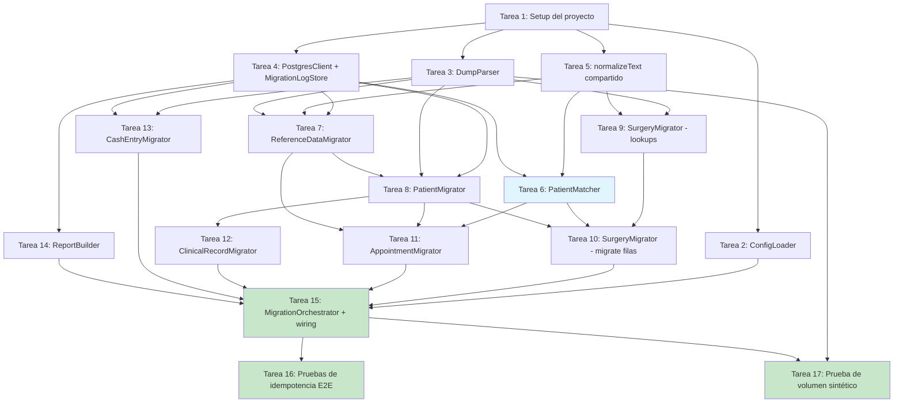

# Implementation Plan

- [x] 1. Configurar el proyecto del script de migración
  - Crear el subproyecto Node.js/TypeScript standalone (`package.json`, `tsconfig.json`) independiente de la app Next.js, con scripts de build/test y un entry point `migrate.ts`
  - Agregar dependencias: `pg`, `natural`, framework de testing (p. ej. `vitest` o `jest`), y tipos de TypeScript correspondientes
  - Definir la estructura de directorios para `config/`, `parser/`, `db/`, `matcher/`, `migrators/`, `report/`, `orchestrator/` y sus respectivas carpetas de tests
  - _Requirements: 10.2_

- [x] 2. Implementar ConfigLoader
  - Definir la interfaz `MigrationConfig` (`dumpFilePath`, `databaseUrl`, `matchConfidenceThreshold`, `matchMinConsiderationThreshold`, `resetMode`, `reportOutputDir`, `insertBatchSize`)
  - Implementar `loadConfig(argv, env)` leyendo flags de CLI (`--dump-file`, `--reset`, `--match-threshold`, `--match-min-threshold`) con fallback a variables de entorno y luego a valores por defecto
  - Implementar validación temprana (fail-fast) de configuración inválida (`DATABASE_URL` faltante, umbrales fuera de rango 0–1)
  - Escribir pruebas unitarias para combinaciones de flags/env/defaults y para los casos de configuración inválida
  - _Requirements: 6.9, 9.3, 10.2, 10.5_

- [x] 3. Implementar DumpParser sobre fixtures de texto
  - Implementar el parser de propósito específico para la gramática `mysqldump` (`CREATE TABLE` para extraer columnas en orden, `INSERT INTO ... VALUES (...);` con soporte single-row y multi-row, ignorando directivas `/*!...*/`, `LOCK TABLES`, `UNLOCK TABLES`)
  - Implementar el procesamiento por streaming de líneas acumulando sentencias lógicas hasta el `;` final no escapado
  - Manejar comillas escapadas (`\'`), backslashes, `\r\n` embebidos, valores `NULL` sin comillas y números sin comillas
  - Implementar la clasificación de tablas: tablas en alcance, tablas explícitamente excluidas (`inst_alt`, `medias`, `ventamedias`) y `unknownTables`
  - Escribir pruebas unitarias con fixtures de texto construidos a mano que reproduzcan: comillas escapadas, `\r\n` embebidos (como en `historiaclinica.datos`), valores `NULL`, multi-row `VALUES`, y un caso de sentencia `INSERT` malformada que debe fallar de forma controlada con número de línea aproximado
  - _Requirements: 10.1, 10.2, 10.3, 11.1_

- [x] 4. Implementar PostgresClient y esquema de control MigrationLogStore
  - Implementar el wrapper `PostgresClient` sobre `pg.Pool` (`withTransaction`, `insertBatch` con construcción de INSERT multi-VALUES parametrizado por lotes de `insertBatchSize`, `query`)
  - Crear el DDL de la tabla `migration_log` (incluyendo el índice `idx_migration_log_lookup`) y la función `ensureSchema`
  - Implementar `findExisting`, `record` y `reset('log-only' | 'full')` de `MigrationLogStore`
  - Implementar el cálculo de `payload_hash` (sha256 de la fila origen normalizada) y la detección de fila ya migrada cuyo contenido de origen cambió
  - Escribir pruebas de integración contra una base Postgres de test (con `schema.sql` aplicado) que verifiquen: creación idempotente del esquema de control, comportamiento de `findExisting`/`record`, y los dos alcances de `reset`
  - _Requirements: 9.1, 9.2, 9.3, 9.4_

- [x] 5. Implementar el normalizador de texto compartido
  - Implementar `normalizeText()` (mayúsculas, remoción de tildes/diacríticos vocálicos preservando `Ñ`, colapso de espacios múltiples, trim, remoción de puntuación común del dataset legacy) como utilidad reutilizable
  - Escribir pruebas unitarias cubriendo mayúsculas/minúsculas mezcladas, tildes (`PEÑA` vs `PENA`), espacios múltiples y puntuación
  - _Requirements: 1.6, 6.1_

- [x] 6. Implementar PatientMatcher
  - Implementar `match(input, mode, candidatePool)` con cálculo de Jaro-Winkler vía `natural.JaroWinklerDistance` sobre texto normalizado con `normalizeText()`
  - Implementar el modo `full_name` con el score combinado ponderado (`0.6 * apellido + 0.4 * nombre`) y el modo `last_name_only` (score directo sobre apellido, válido solo si produce exactamente un candidato confiable)
  - Implementar la clasificación de candidatos por umbral mínimo de consideración y umbral de confianza, incluyendo el margen de separación de ambigüedad (`matchAmbiguityMargin`), produciendo `auto_linked`, `manual_review` o `no_match`
  - Implementar el caso de texto de entrada vacío o solo espacios → `no_match` directo sin calcular score
  - Implementar la construcción determinística del `candidatePool` (ordenado por `patients.id` ascendente)
  - Implementar la pasada de detección de posibles pacientes duplicados en destino (autocomparación del pool contra sí mismo, excluyendo la diagonal, mismo umbral de confianza)
  - Escribir pruebas unitarias con pares de nombres reales de `sample_dump.sql` cubriendo explícitamente los cuatro desenlaces (`auto_linked`, `manual_review`, `no_match`, texto vacío), ambos modos por separado, casos con tildes, y el caso de detección de duplicados en destino
  - _Requirements: 6.1, 6.2, 6.3, 6.4, 6.5, 6.6, 6.7, 6.9, 6.10, 9.5_

- [x] 7. Implementar ReferenceDataMigrator
  - Implementar `migrateDoctors`, `migrateHealthInsurances`, `migrateVisitReasons`: por cada fila del dump, normalizar el nombre con `normalizeText()`, buscar coincidencia exacta normalizada en destino; si existe, registrar en `migration_log` como `migrated` reusando el `target_id` existente sin duplicar; si no existe, insertar preservando el id legacy explícito y ajustar la secuencia (`setval`) al final
  - Implementar `verifySchedules`: verificar que cada `Horarios_id` del dump exista en `schedules`, reportando advertencia para los que no existan, sin insertar nada
  - Implementar la validación de `Horarios_estado ∈ {0,1,2}`, marcando como error de mapeo de doctor y excluyendo del conteo de verificación exitosa los valores fuera de ese conjunto, sin detener la migración
  - Escribir pruebas unitarias/de integración para: doctor/obra social/motivo nuevo vs. ya existente (detección de duplicado case-insensitive y espacios normalizados), horario inexistente en destino, y `Horarios_estado` inválido
  - _Requirements: 1.1, 1.2, 1.3, 1.4, 1.5, 1.6_

- [x] 8. Implementar PatientMigrator
  - Implementar `migrate(rows, doctorIdMap)` mapeando los campos de `fichas` a `patients` según `docs/sdd.md` sección 4, excluyendo `fuente`, `lugarTrabajo`, `tipoTrabajo`, `trabajoConyuge`, `tipoTrabajoConyuge`
  - Implementar la resolución de `doctor_id`: `profesional === '0'` → `NULL`; valor numérico que resuelve contra `doctorIdMap` → ese id; valor que no resuelve → `NULL` + advertencia en el reporte
  - Implementar la conversión de fechas sentinela (`'0000-00-00'`) a `NULL` en los campos de fecha del destino
  - Implementar la retención en memoria de `valorConsulta` asociado a `idFicha` (sin escribirlo en `patients`) para su uso posterior por `ClinicalRecordMigrator`
  - Implementar el registro en `migration_log` (`source_table: 'fichas'`) y la construcción de `legacyIdToPatientId`
  - Integrar la idempotencia: antes de procesar cada fila, consultar `MigrationLogStore.findExisting` y reusar `target_id` sin reinsertar ni recalcular si ya existe
  - Escribir pruebas unitarias/de integración cubriendo cada regla de transformación (incluyendo doctor no resuelto, fechas sentinela, retención de `valorConsulta`) y una prueba específica de idempotencia (ejecutar `migrate` dos veces sobre el mismo conjunto de filas y verificar que la segunda corrida no inserte filas nuevas y devuelva el mismo `legacyIdToPatientId`)
  - _Requirements: 2.1, 2.2, 2.3, 2.4, 2.5, 2.6, 2.7, 9.1, 9.2, 9.4, 9.5_

- [x] 9. Implementar SurgeryMigrator: población de lookups
  - Implementar `populateLookups(rows)` extrayendo valores distintos no vacíos de `diagnostico` → `surgery_diagnoses`, de `miembro` → `body_parts`, y de `tecnica1`/`tecnica2`/`tecnica3` combinados → `surgery_techniques`, usando `normalizeText()` para detectar existentes y evitar duplicados
  - Escribir pruebas unitarias/de integración verificando que valores vacíos no generan entradas de lookup y que valores repetidos (incluso con variaciones de mayúsculas/espacios) no se duplican
  - _Requirements: 5.1, 5.2, 5.3_

- [x] 10. Implementar SurgeryMigrator: migración de filas de cirugías
  - Implementar `migrate(rows, lookups, patientPool)` resolviendo `diagnosis_id`/`body_part_id` contra los maps de lookup, dejando `NULL` sin crear entrada cuando el valor de origen está vacío
  - Implementar el mapeo `date ← fecha` y `outcome ← evolucion`
  - Implementar la inserción de una fila en `surgery_applied_techniques` por cada técnica no vacía entre `tecnica1/2/3`, con `order_index` 1/2/3 según la columna de origen
  - Integrar la resolución de paciente vía `PatientMatcher.match({lastName: apellido, firstName: nombre}, 'full_name', patientPool)`, sin emitir ningún `UPDATE` sobre `patients` con los datos de texto libre de `cirugias`
  - Escribir pruebas unitarias/de integración para: diagnóstico/miembro vacío, técnicas múltiples con `order_index` correcto, y los tres desenlaces de matching de paciente aplicados a filas de `cirugias`
  - _Requirements: 5.4, 5.5, 5.6, 5.7, 5.8, 6.7_

- [x] 11. Implementar AppointmentMigrator
  - Implementar `migrate(rows, context)` con el mapeo directo `Turno_motivoid → reason_id`, `Turno_doctor → doctor_id`, `Turno_fecha → date`, `Turno_hora → schedule_id`, `Turno_obrasocialid → insurance_id`, descartando `Turno_telefono`
  - Integrar la resolución de `Turno_paciente` vía `PatientMatcher.match(..., 'last_name_only', patientPool)`
  - Implementar la validación de `Turno_hora` contra `scheduleIds`: si no existe, `schedule_id = NULL` + advertencia
  - Implementar el mapeo determinístico `APPOINTMENT_STATUS_MAP` con `DEFAULT_APPOINTMENT_STATUS = 'pending'`, registrando advertencia para valores de `Turno_estado` no contemplados
  - Escribir pruebas unitarias/de integración cubriendo: mapeo directo de campos, horario inexistente, estado no contemplado en el mapa, y los tres desenlaces de matching de paciente aplicados a `inst_turnos`
  - _Requirements: 3.1, 3.2, 3.3, 3.4, 3.5, 6.5, 6.7_

- [x] 12. Implementar ClinicalRecordMigrator
  - Implementar `migrate(rows, legacyIdToPatientId, visitFeeByLegacyPatientId)` generando un registro independiente por fila de `historiaclinica` con id autogenerado (sin preservar la clave compuesta original)
  - Implementar la resolución de `idHistoriaClinica` a `patient_id` vía `legacyIdToPatientId`; si no resuelve, excluir la fila y registrar error en el reporte
  - Implementar el reemplazo de ` ` (y variantes ` `, ` `) por salto de línea en `datos` antes de insertar en `notes`
  - Implementar el mapeo `fechaConsulta → visit_date` y la asignación de `visit_fee` desde `visitFeeByLegacyPatientId`
  - Escribir pruebas unitarias/de integración cubriendo: paciente no resuelto (fila excluida), reemplazo de ` ` y variantes, y asignación correcta de `visit_fee`
  - _Requirements: 4.1, 4.2, 4.3, 4.4, 4.5, 2.6_

- [x] 13. Implementar CashEntryMigrator
  - Implementar la conversión de `ingresosCaja`/`egresosCaja` de VARCHAR con coma decimal a DECIMAL (`replace(',', '.')` + `parseFloat`) con comparación contra cero con tolerancia de punto flotante
  - Implementar las reglas de clasificación: solo ingreso → `type: 'income'`; solo egreso → `type: 'expense'`; ambos distintos de cero → error de datos ambiguos, fila excluida; ambos cero o vacíos → fila omitida (no error)
  - Implementar la exclusión de filas con `fechaCaja === '0000-00-00'` como error de fecha inválida
  - Implementar el mapeo `conceptoCaja → description`
  - Escribir pruebas unitarias cubriendo explícitamente los cinco casos de Requirement 7.1–7.6 (income, expense, ambiguo, omitido, fecha inválida)
  - _Requirements: 7.1, 7.2, 7.3, 7.4, 7.5, 7.6, 7.7_

- [x] 14. Implementar ReportBuilder
  - Implementar `addTableSummary`, `addExcludedTable`, `addDuplicatePatientPairs` y `build(runStartedAt)` consolidando los `AuditEvent` emitidos por todos los migradores en el objeto `MigrationReport`
  - Implementar `writeToDisk` generando `migration-report-<timestamp>.json` (estructura completa máquina-legible con las secciones `summaryByTable`, `excludedTables`, `patientMatching` con sub-secciones `autoLinked`/`manualReview`/`noMatch`/`possibleDuplicatesInTarget`, `errors`, `warnings`) y `migration-report-<timestamp>.md` (resumen legible con tabla por tabla y secciones dedicadas para revisión manual, sin coincidencia, duplicados en destino, y errores/advertencias) en `config.reportOutputDir`
  - Garantizar que el nombre de archivo incluye timestamp de la corrida para no sobrescribir reportes previos
  - Escribir pruebas unitarias verificando: estructura y validez del JSON generado, formato Markdown bien formado, inclusión de las tablas explícitamente excluidas con su motivo, y no colisión de nombres entre corridas sucesivas
  - _Requirements: 8.1, 8.2, 8.3, 8.4, 8.5, 8.6, 11.2_

- [x] 15. Implementar MigrationOrchestrator y wiring completo
  - Implementar `run(config)` ejecutando la secuencia completa: `ensureSchema` → modo reset condicional → `ReferenceDataMigrator` (doctores/obras sociales/motivos/horarios) → `PatientMigrator` → `SurgeryMigrator.populateLookups` → construcción del `patientPool` → `AppointmentMigrator` y `SurgeryMigrator.migrate` en secuencia → `ClinicalRecordMigrator` → `CashEntryMigrator` → detección de duplicados en destino → `ReportBuilder.build` + `writeToDisk`
  - Integrar la detección y registro inmediato de tablas fuera de alcance (`inst_alt`, `medias`, `ventamedias`) como excluidas intencionales antes de invocar cualquier migrador
  - Implementar el manejo de errores de transacción por tabla (rollback de lote, reintento fila por fila en modo degradado ante violación de constraint, aislando y excluyendo solo la fila que falla) y el manejo de tablas desconocidas en el dump como advertencia de proceso sin abortar
  - Implementar el CLI entry point `migrate.ts` que invoca `ConfigLoader.loadConfig` y `MigrationOrchestrator.run`, e imprime en consola el resumen final y las rutas de los reportes generados
  - Escribir una prueba de integración de corrida completa contra una base Postgres de test pre-cargada con `schema.sql` y los seeds de referencia, ejecutando contra `sample_dump.sql` y verificando los conteos esperados por tabla, la clasificación del caso conocido `Turno_paciente = 'Amadei'`, y que el reporte generado en disco contiene las secciones obligatorias y es JSON válido + Markdown bien formado
  - _Requirements: 5.1, 5.2, 5.3, 9.4, 10.1, 10.6, 11.1, 11.2_

- [x] 16. Escribir pruebas de reejecución e idempotencia de punta a punta
  - Escribir una prueba de integración que ejecute `MigrationOrchestrator.run` dos veces consecutivas sobre la misma base de test y el mismo `sample_dump.sql`, verificando que los conteos de filas en cada tabla destino no cambien entre la primera y la segunda corrida
  - Escribir una prueba de integración que ejecute la migración, aplique `--reset` con alcance `full`, y verifique que una corrida posterior reprocesa todas las filas desde cero sin requerir intervención manual sobre la base
  - Escribir una prueba que verifique que el resultado de matching de pacientes (Requirement 6) es idéntico entre la primera y la segunda corrida dado el mismo estado de `patients`
  - _Requirements: 9.1, 9.2, 9.3, 9.5_

- [x] 17. Escribir prueba de volumen sintético para preparación ante el dump completo
  - Generar (en el propio código de test, no como dump real) un fixture sintético de un orden de magnitud mayor a `sample_dump.sql` para las tablas con más filas esperadas (`fichas`, `inst_turnos`, `caja`), incluyendo INSERTs multi-row
  - Ejecutar `DumpParser` y el pipeline de inserción por lotes (`insertBatchSize`) contra ese fixture y verificar que el procesamiento completa sin error y sin necesidad de cambios de código, validando el comportamiento por streaming del parser
  - _Requirements: 10.3, 10.5_

## Tasks Dependency Diagram

